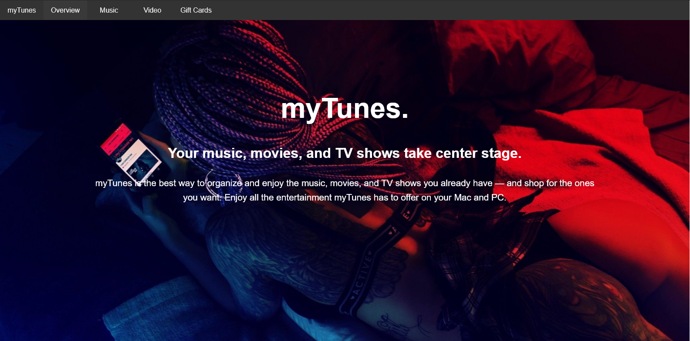
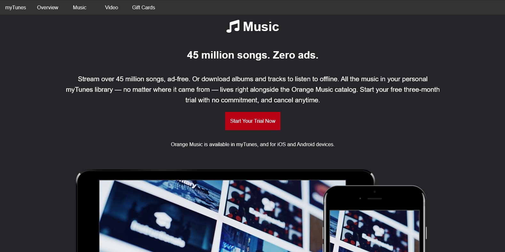
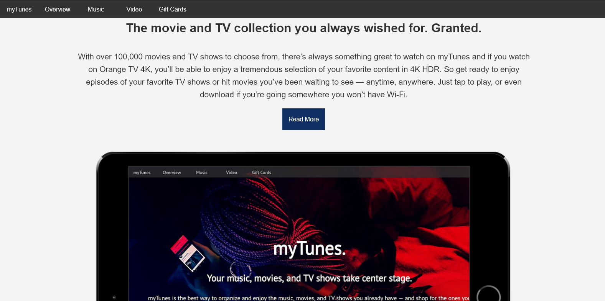
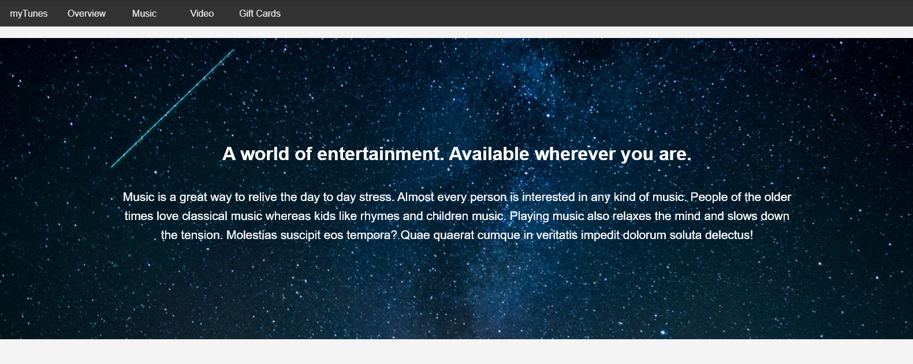
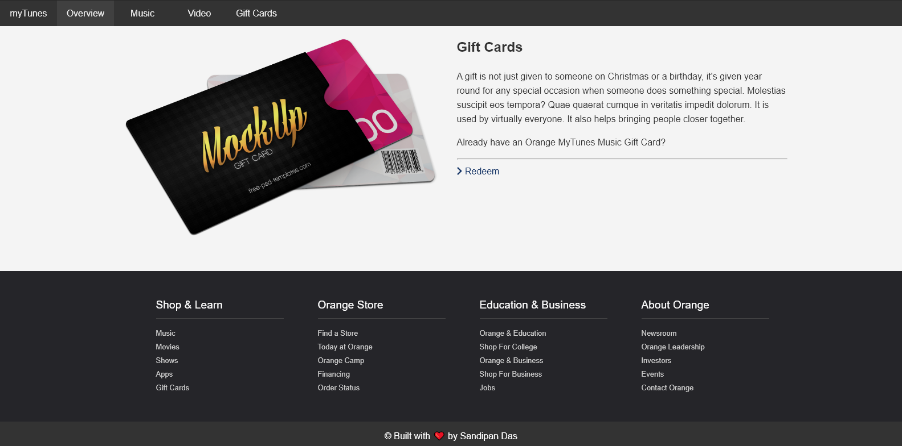

<h2 align="center">My-README.md-Template</h2>

<p align="center">
   
</p>

<p align='center'> 
   
   
   
   
   <br>
   
   </a><br>
</p>
<p align="center">
  <a href="https://github.com/sandip2224/myTunes-Music-Website"><strong>Explore the docs »</strong></a>
</p>

<!-- PROJECT LOGO -->
  <p align="center">
    <br />
    <a href="https://github.com/sandip2224/myTunes-Music-Website">View Demo</a>
    ·
    <a href="https://github.com/sandip2224/myTunes-Music-Website/issues">Report Bug</a>
    ·
    <a href="https://github.com/sandip2224/myTunes-Music-Website/issues">Request Feature</a>
  </p>

<!-- TABLE OF CONTENTS -->
<h2 align="center">Table of Contents</h2>

- [About the Project](#about-the-project)
   - [Preview](#preview)
   - [Built With](#built-with)
- [Getting Started](#getting-started)
   - [Folder Structure](#folder-structure)
   - [Prerequisites](#prerequisites)
   - [Installation](#installation)
- [License](#license)
- [Contributing](#contributing)
- [Contact](#contact)
- [Acknowledgements](#acknowledgements)


<!-- ABOUT THE PROJECT -->

<h2 align="center">About the Project</h2>

This website is a based on a fictitious music application named **myTunes**. It's built with HTML markup, basic CSS styling and JavaScript. The entire website is garnished by a smooth-scroll effect and is based on a consistent dark theme with alternating light backgrounds. I know you'll love it.

Here's why it's so awesome:  

- ***The website is fully responsive and scales down perfectly on smaller viewports*** 😁  
- ***The website incprporates parallax scroll effect on larger viewports.*** ✅  
- ***Scroll animations add the final touch to this website.*** 🖖  

> I encourage you to suggest changes by forking this repository and creating a pull request or opening an issue.  

<p align="right"><a href="#table-of-contents">🔼 Back to top</a></p>
<!-- Preview -->
<h2 align="center">Preview</h2>

**Homepage**
<p align="center"></p>

**Music Page**
<p align="center"></p>

**Video Page**
<p align="center"></p>

**Entertainment section**
<p align="center"></p>

**Gift page + Footer**
<p align="center"></p>


<!-- BUILT WITH -->  

<h2 align="center">Built With</h2>

<p align="center">
   
   
   
</p>

<!-- GETTING STARTED -->

<h2 align="center">Getting Started</h2>

To get a local copy up and running follow these simple example steps as mentioned under [Installation](#installation) section below

<!-- FOLDER STRUCTURE -->
<h2 align="center">Folder Structure</h2>

```
   |
   ├── dist
   ├──────── css           # CSS source folder
   ├──────── img           # Images folder
   ├──────── js            # Javascript folder
   ├──────── parallax      # Parallax.js files
   └── index.html          # HTML markup file
```

<!-- PREREQUISITES -->

<h2 align="center">Prerequisites</h2>

- [x] HTML 5 markup
- [x] CSS styling
- [x] JavaScript
- [x] AOS library
- [x] Parallax.js library

<p align="right"><a href="#table-of-contents">🔼 Back to top</a></p>
<!-- INSTALLATION -->
<h2 align="center">Installation</h2>

1. Fork and clone this repository using  

```
  git clone https://github.com/sandipan_2224/myTunes-Music-Website.git
  cd myTunes-Music-Website  
```  

2. Set up live server inside `index.html` using a HTML code editor (eg.: VSCode)

<!-- LICENSE -->  

<h2 align="center">License</h2>

Distributed under the MIT License. See `LICENSE` for more information.  


<!-- CONTRIBUTING -->
<h2 align="center">Contributing</h2>

Contributions are what make the open source community such an amazing place to be learn, inspire, and create. Any contributions you make are **greatly appreciated**.

1. Fork the Project
2. Create your Feature Branch (`git checkout -b feature/AmazingFeature`)
3. Commit your Changes (`git commit -m 'Add some AmazingFeature'`)
4. Push to the Branch (`git push origin feature/AmazingFeature`)
5. Open a Pull Request  

<p align="right"><a href="#table-of-contents">🔼 Back to top</a></p>
<!-- CONTACT --> 

<h2 align="center">Contact</h2>

- **Reach out to me at** [ sandipan2224@gmail.com](sandipan2224@gmail.com)  

<!-- ACKNOWLEDGEMENTS -->

<h2 align="center">Acknowledgements</h2>

* [HTML docs](https://www.w3schools.com/html/)
* [CSS docs](https://www.w3schools.com/css/default.asp)
* [JavaScript basics](https://www.w3schools.com/js/default.asp)

<h4 align="right">Built with :heart: by <a href="https://linkedin.com/in/sandipan0164">Sandipan Das</a></h4>
